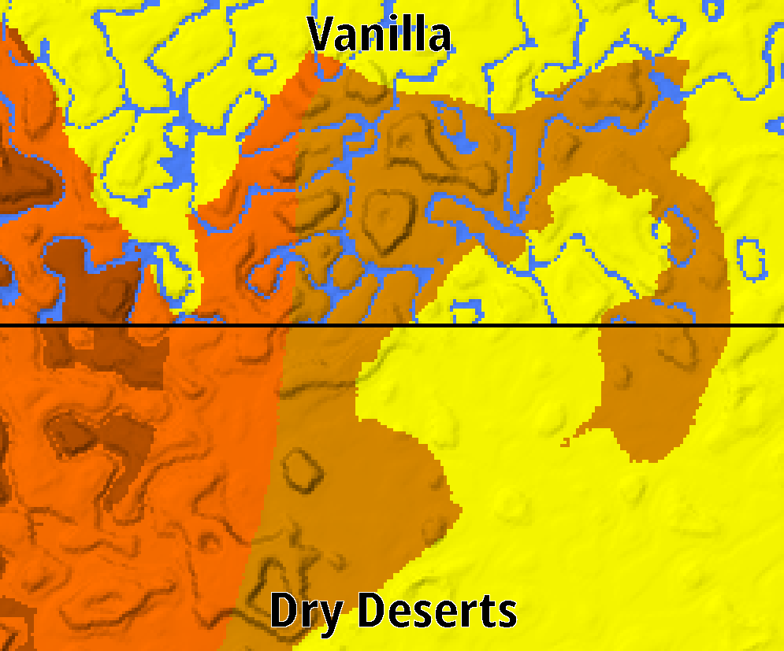

# Dry Deserts

Dry Deserts stops rivers from generating in desert and badland biomes, making them truly feel like arid biomes.

You might still see the occasional body of water in those biomes, especially near coasts and aquifers, however no river biomes should generate in deserts.

🚨 To use with Large Biomes, you must make a change in the datapack files 🚨

## Configurability (Datapack only)

- While the datapack will be active if you generate a world with the large biomes preset, it will not work correctly unless you make a change to `Dry-Deserts/data/minecraft/worldgen/desity_functions/overworld/ridges.json`, there are instructions there as to what you need to do
- By default rivers are completely prevented from generating in deserts, however there are a couple options available to allow some river generation, check the `README.md` file in the pack folder. You can use the [Minecraft Datapack Map](https://map.jacobsjo.eu/) to check your changes

---

Maps created with the [Datapack Map](https://map.jacobsjo.eu/) by jacobsjo
